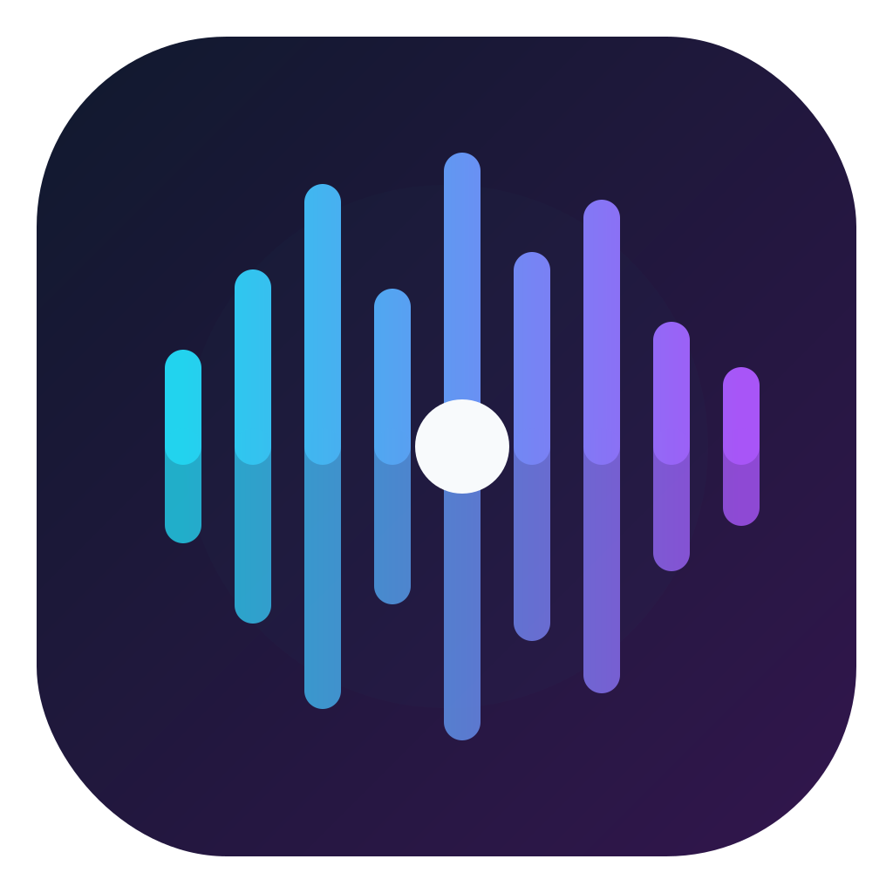
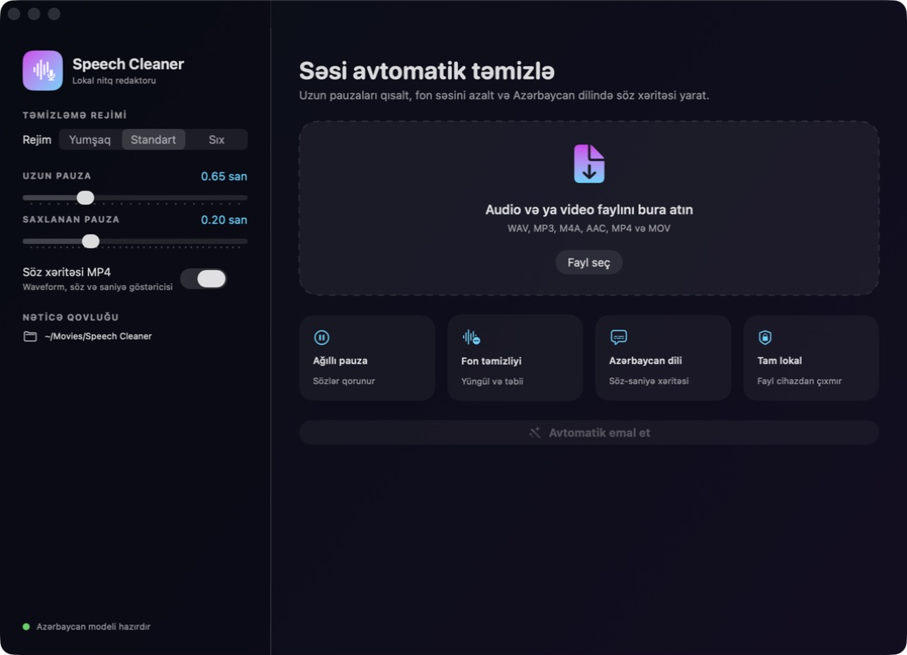
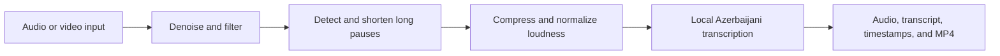

# Speech Cleaner

> A privacy-first macOS app that cleans spoken audio, shortens long pauses, and creates word-level timestamps for Azerbaijani speech — entirely on device.

<p align="center">
  
</p>

<p align="center">
  <a href="LICENSE"></a>
  
  
  
</p>



## Why Speech Cleaner?

Editing voiceovers by hand is repetitive: remove awkward gaps, reduce constant background noise, normalize volume, transcribe the result, and prepare assets for video editing. Speech Cleaner turns that workflow into one local pipeline while keeping the source file unchanged.

It is designed primarily for Azerbaijani speech and content creators who want faster, consistent voiceover cleanup without uploading recordings to a cloud service.

## Features

- Imports WAV, MP3, M4A, AAC, MP4, and MOV files
- Offers Gentle, Standard, and Strong cleaning profiles
- Detects long silences and removes only their middle section to keep speech natural
- Applies high-pass/low-pass filtering, FFT denoising, light compression, and loudness normalization
- Runs Azerbaijani transcription locally with `whisper.cpp` and a multilingual Whisper model
- Exports a clean 24-bit WAV and 192 kbps M4A
- Produces word-level CSV and JSON timestamps, plus readable SRT and TXT transcripts
- Optionally renders a 1280×720 H.264/AAC waveform video with the current word
- Never modifies the source file or sends media to a server

## Technology

| Layer | Technology |
|---|---|
| Desktop UI | SwiftUI, AppKit |
| Audio playback | AVFoundation |
| Audio processing | FFmpeg |
| Speech recognition | whisper.cpp, Whisper medium Q5 multilingual model |
| Video rendering | AVAssetWriter, Core Graphics, Core Text |
| Build | Swift Package Manager, zsh |

## Requirements

- macOS 14 Sonoma or newer
- Apple Silicon Mac
- [Homebrew](https://brew.sh/)
- FFmpeg and whisper.cpp
- Whisper `ggml-medium-q5_0.bin` model (about 514 MB)

## Quick start

1. Install the command-line dependencies:

   ```bash
   brew install ffmpeg whisper-cpp
   ```

2. Clone the repository:

   ```bash
   git clone https://github.com/JamalJavadov/speech-cleaner.git
   cd speech-cleaner
   ```

3. Download the multilingual medium Q5 model and place it at:

   ```text
   ~/Library/Application Support/Speech Cleaner/Models/ggml-medium-q5_0.bin
   ```

   The model used during development has this SHA-256 checksum:

   ```text
   19fea4b380c3a618ec4723c3eef2eb785ffba0d0538cf43f8f235e7b3b34220f
   ```

4. Build and install the app:

   ```bash
   ./scripts/build-app.sh --install
   open "/Applications/Speech Cleaner.app"
   ```

The app is ad-hoc signed for local development. On first launch, macOS may require you to allow the app in **System Settings → Privacy & Security**.

## Output

Each run creates a dedicated result folder containing:

```text
cleaned-voice.wav       # 24-bit archival/editing audio
cleaned-voice.m4a       # compact 192 kbps delivery audio
word-timestamps.csv     # word-level timing table
word-timestamps.json    # structured word timing data
transcript.srt          # subtitle file
transcript.txt          # readable transcript
word-map.mp4            # optional waveform and active-word video
processing-report.json  # reproducible processing summary
```

## How it works



For a deeper technical overview, see [Architecture](docs/ARCHITECTURE.md). Real-device measurements are available in [Performance](PERFORMANCE.md).

## Benchmark mode

Run the production pipeline without opening the UI:

```bash
.build/release/SpeechCleaner --benchmark /path/to/audio.wav \
  --output /tmp/SpeechCleaner-Benchmark
```

Add `--no-mp4` to skip video rendering.

## Contributing

Contributions and reproducible bug reports are welcome. Read [CONTRIBUTING.md](CONTRIBUTING.md) before opening a pull request. Please report security-sensitive issues using [SECURITY.md](SECURITY.md), not a public issue.

## Privacy

Speech Cleaner does not include analytics, accounts, network uploads, or cloud processing. FFmpeg, whisper.cpp, and the model all run locally. Files selected by the user remain on the Mac.

## License

Released under the [MIT License](LICENSE).
